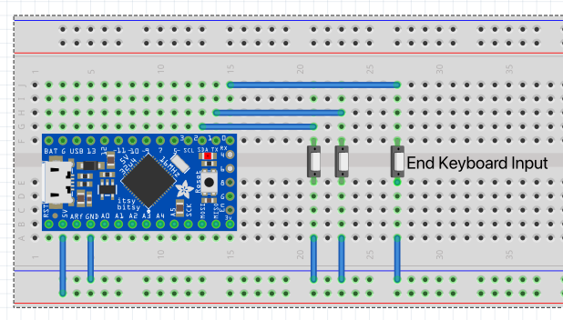

= Arduino Keyboard

This is a project of the Hackathon week in 2021
of the Red Hat console.dot team.

The idea is to use an Arduino as external Keyboard,
a little bit like StreamDeck.

It requires Arduino boards/clones that support the
https://www.arduino.cc/reference/en/language/functions/usb/keyboard/[Keyboard libraries]
to send keyboard code via USB as Human Input Devices (HID)

An example board is the https://learn.adafruit.com/introducting-itsy-bitsy-32u4[Adafruit ItsyBitsy 32u4]

== Wiring setup

.Example wiring setup in Fritzing

Currently pins 1 and 2 are connected to push-buttons that serve as input.
This is because on Atmel 32u4-based boards only digital pins 0,1,2,3 and 7
can be used for interrupts. 
See https://www.arduino.cc/reference/en/language/functions/external-interrupts/attachinterrupt/[attachInterrupt()]
documentation at the Arduino reference.

Digital pin 0 is used to 'stop' the Keyboardinput mode. I found out (and the Adafruit docs
talk about it), that it can be hard to do anything with the board if it is firing
characters at you at high rate. 
