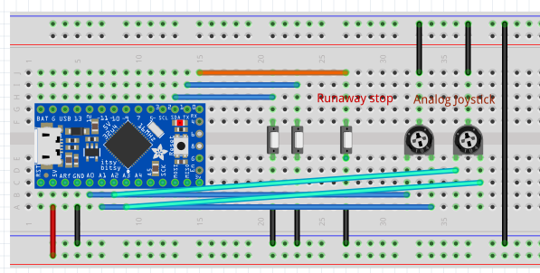

= Arduino-based computer input

This is a project of the Hackathon week in 2021
of the Red Hat console.dot team.

.Picture of my setup. Arduino with buttons in the back, Joystick in front.

== Abstract

The original idea was to use an Arduino as external Keyboard,
a little bit like StreamDeck. That requires additional code on the
host computer to support 

It requires Arduino boards/clones that support the
https://www.arduino.cc/reference/en/language/functions/usb/keyboard/[Keyboard]
and
https://www.arduino.cc/reference/en/language/functions/usb/mouse/[Mouse]
libraries to send keyboard code via USB as Human Input Devices (HID)

An example board is the https://learn.adafruit.com/introducting-itsy-bitsy-32u4[Adafruit ItsyBitsy 32u4]
that I am using.

== Wiring setup

.Example wiring setup in Fritzing

=== Buttons

Currently pins 1 and 2 are connected to push-buttons that serve as input.
This is because on Atmel 32u4-based boards only digital pins 0,1,2,3 and 7
can be used for interrupts. 
See https://www.arduino.cc/reference/en/language/functions/external-interrupts/attachinterrupt/[attachInterrupt()]
documentation at the Arduino reference.

Digital pin 0 is used to 'stop' the Keyboardinput mode. I found out (and the Adafruit docs
talk about it), that it can be hard to do anything with the board if it is firing
characters at you at high rate. 

=== Analog joystick

I have added an analog joystick that is bascially two coupled potentiometers.
The middle pin is connected to ground and the left and right sides are connected
to two analog pins repsectively.

In the code we are first reading the values and then computing the movement.
As this is analog, values can range from 0..1023. 
For the way it is connected, I can build the difference of the readings of
the two analog pins to determine the direction and strenght of the press.
The resulting values are for my Joystick in the range of 0..255.

When the joystick is in the middle position, the difference is often 
slightly larger than 0.
The code thus first checks if there is enough difference and then maps
the difference to a range of 0..10. The result is then fed into the 
mouse movement.

[source,cpp]
----
  a0 = analogRead(A0);
  a1 = analogRead(A1)
  xDir = a0-a1;
  if (abs(xDir) < MOVEMENT_THRESHOLD) { // Threshold for movement
    xDir = 0;
  }
  else {
    xDir = map(xDir, -255,255,-10,10);
  }
  [...]
  Mouse.move(xDir,yDir,0);
----

.INFO
Kudos to my daughter, who soldered me some little adapter boards for the joystick 
to be put in the breadboard.
